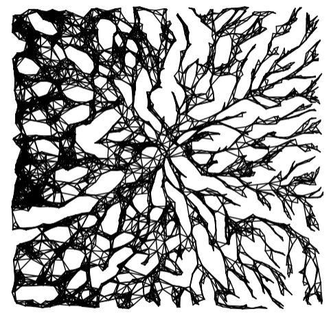
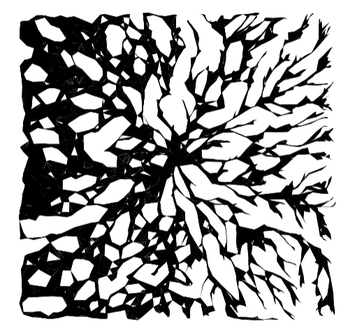
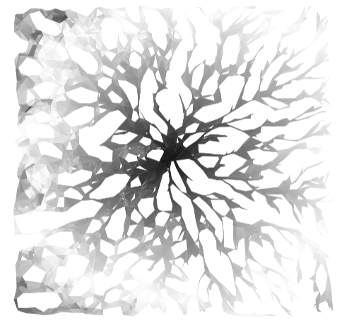
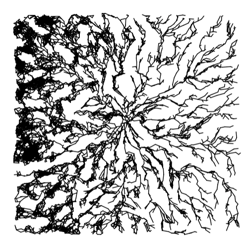
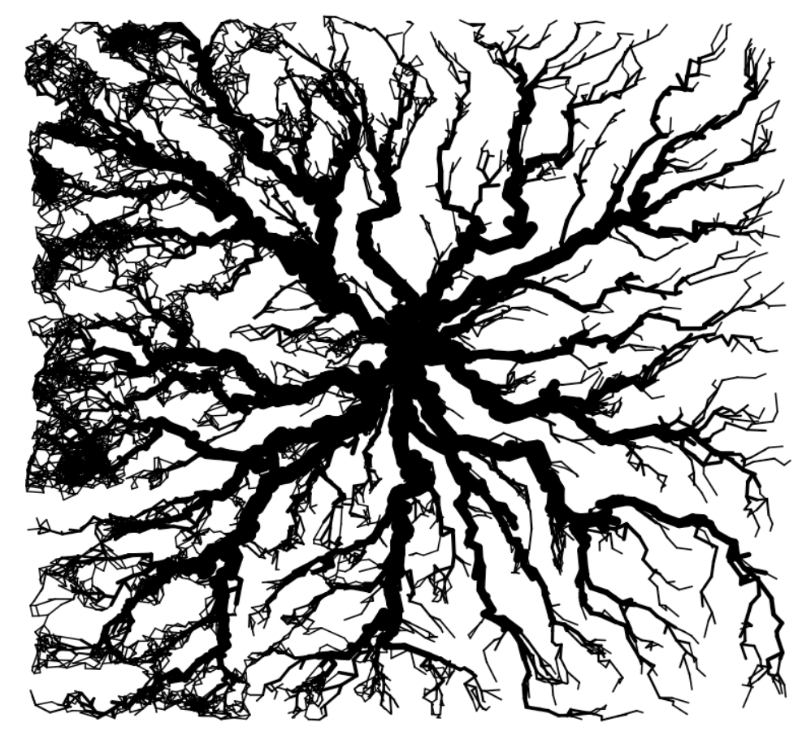
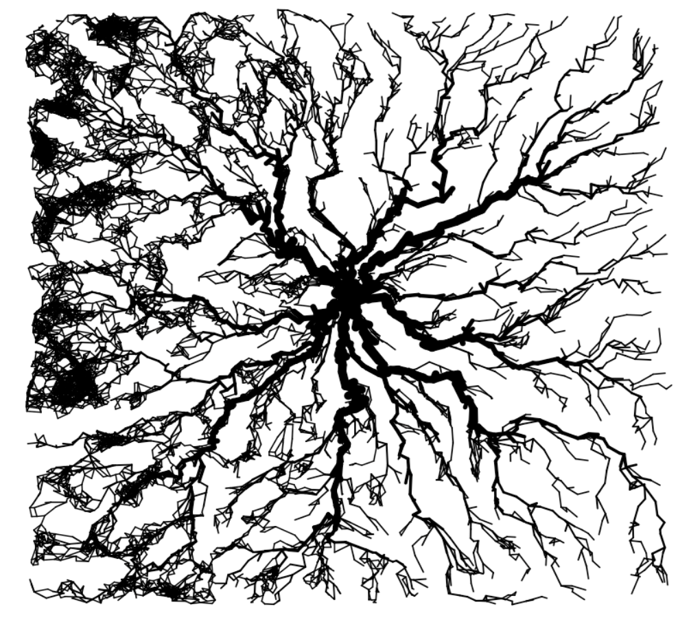

Highly optimized implementation of the TGM as described in Korr and Mulder 20XX
Intended to facilitate the use of the TGM in research. Designed to be highly reproducible; RNG is heavily controlled and parameters are convenient to track, change, and share.

NOT designed for tweaking/modification of the algorithm; the optimizations necessitate a somewhat obfuscated codebase. Please create your own implementation for those purposes; the paper and Python.ipynb serve as a good reference for this.

todo: need to link to Korr and Mulder 20XX and clarify that this page references the text

# Basic Usage:

Download:
```
pak::pkg_install("gbkorr/TGM")
library(TGM)
```

[Intitialize Simulation](#initialize-simulation)  
[Timestep/Tick Sim](#timestep-sim)  
[Draw/Visualize Sim](#draw-sim)  
[Spatial Variation](#spatial-variation)  
[Analysis](#analysis)  

## Initialize Simulation:

```
sim = Sim(
	Rules(
		link_range = 0.18,
		mobility = 0.04,
		contraction = 1.0,
		cohesion = 0.0,
		branching = 1.0,
	
		seed = 1, #RNG seed for growth
		seed_pos = NULL, #if defined, exact coordinates of starting link
		growth_rate = 0.05 #usually constant
	)
)
```

Change bounding region size/particle density:
```
sim = Sim(Rules(),
	State(P_rules(
		size = 8, #length and width of bounding region
		density = 200, #particles/unit
		particle_seed = 1 #RNG seed for particle distribution
	))
)
```
> Note: particle distribution RNG is tied to the size and density, so the same `particle_seed` will NOT produce the the same pattern if the size is changed.

## Timestep Sim

```
sim = tick(sim, n_ticks)
```
Sim objects track their own RNG.

## Draw Sim

```
draw(sim,type='l',args=NULL)
```

Types:

- links (l): Draws the links as in (Fig. 2)
- tris (t): Draws the triangles shaded in. Recommended for porous morphologies.
- bands (b): Tris colored by generation. The more chaotic the system is, the less smooth these rings will be.
- network (n): Draws the nodes and edges of the network of triangles (Fig. 11).
- descendants (d): Variable branch thickness based on number of descendants. (Fig. 4).
- order (o): Variable branch thickness based on number of downstream leaves.

`type='l'` and `type='links'` both work.








You can pass args to certain types, e.g.
```
draw(sim,type='d',args=list(
	min = 1,
	max = 10,
	scale = 0.01
))
```
- bands: args=integer for band period; how many generations for the pattern to repeat? Default 100.
- descendants/order: args=list(min,max,scale) parameters for branch thickness; `line weight = max-(max-min)*(1+s)^(-d)` (see §4.2 Modification Details). Default above.


## Spatial Variation

Parameters can be defined to vary spatially (as described in the paper) by defining them with a function of location. Location (xy) should be a 2-length vector of x and y.

E.g.:
```
sim = Sim(Rules(
	cohesion = function(xy){0.6 * (8 - xy[1])/8} #0.0 to 0.6 based on X coordinate
),
State(P_Rules(
	size = 4
)))
sim = tick(sim,2000)
```

Images in the previous section.

## Analysis

todo


